<picture>
  <source media="(prefers-color-scheme: dark)" srcset="assets/banner-dark.svg">
  
</picture>

### NAME

**kris** — backend engineer in Amsterdam. Mostly C# and .NET; lately, language models on a short leash.

### DESCRIPTION

I like systems that are simple enough to reason about and honest enough to say when they have broken.

The day job is backend architecture: APIs, clean boundaries, and more and more retrieval, document
processing and agents — the part of a system where a confident wrong answer is cheapest to produce
and most expensive to ship. So the answer I trust most, from people and from software, is
*I don't know yet*.

Most of what I build is private. What is here is either something worth keeping, or a fix worth
sending back upstream.

### OPTIONS

```text
--test-first     The test fails before the code exists, then it passes.
                 In that order, or it did not happen.

--fail-loudly    No magic fallbacks. A broken thing says it is broken, by name,
                 before someone finds out the hard way.

--no-new-debt    Whatever a change made worse, that change fixes.
                 "Later" is not a branch.

--agent-first    IDEs are to software what a manual gearbox is to driving:
                 precise, once essential, increasingly optional.
                 I state the intent and review the drive.
```

### FILES

**[claude-crew](https://github.com/mike-echo-oscar-whiskey/claude-crew)** — a Claude Code plugin that
turns one session into a delivery lead with a crew of seventeen scoped specialists, a per-project
stack profile, and a story → design → tasks → PR pipeline on GitHub issues. Every code persona
quotes its failing test before its passing one. The README has a section called *Honest limits*.

**[media-stack](https://github.com/mike-echo-oscar-whiskey/media-stack)** — seventeen containers that
find, fetch, name and serve a media library, wired together by one script you can re-run whenever
you like. Every step prints `ok` when it changed something and `kept` when it was already right, so
a second run should change nothing.

Both have seventeen moving parts. Coincidence, probably.

### PATCHES

Sent upstream rather than kept in a fork that drifts:

- **spotweb** — search terms in a non-Latin script were silently dropped; now they match
  ([#1001](https://github.com/spotweb/spotweb/pull/1001), merged)
- **spotweb** — the Newznab API returns a category for UHD movie spots
  ([#1000](https://github.com/spotweb/spotweb/pull/1000), merged)
- **omarchy** — local audio outputs are listed before network ones, so the built-in speakers stop
  hiding under every AirPlay receiver in the house
  ([#12231](https://github.com/omacom/omarchy/pull/12231))

### ENVIRONMENT

```text
OS          Omarchy, on Arch.
STREAMING   none. Every subscription cancelled: €1,558.66 a year back,
            in exchange for being increasingly inconvenienced. Worth it.
BALANCE     upside down, on purpose. Handstands, in practice;
            gravity still wins the long holds.
```

### BUGS

Commit subjects are full sentences. Some of them are long sentences.

Asks *how do we know?* about every number, including his own.

### SEE ALSO

[LinkedIn](https://www.linkedin.com/in/kriskater/) ·
[mike-echo-oscar-whiskey.github.io](https://mike-echo-oscar-whiskey.github.io/)

<p align="right"><sub>KRIS(1) · Amsterdam · exits non-zero when something is wrong</sub></p>
